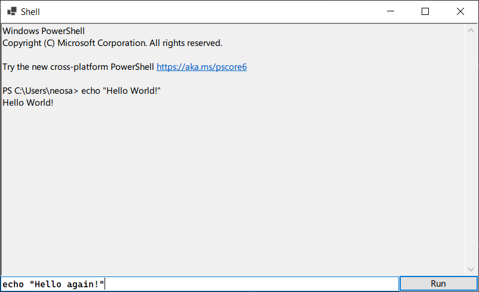
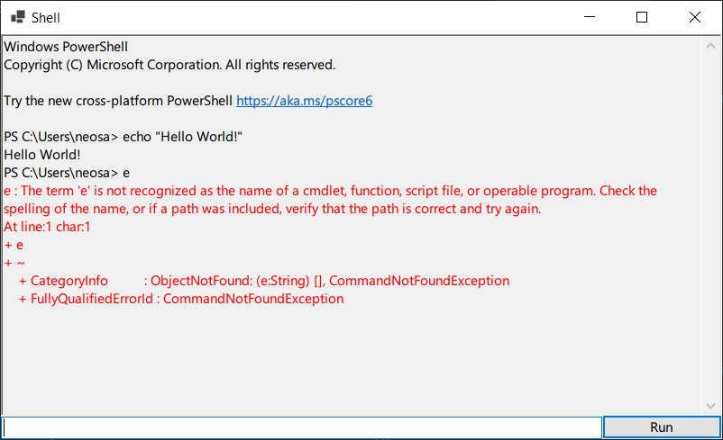

# Shell

Basic Powershell wrapper built in C#.

## Features

- Live output from Powershell
- Colour coded output

## Building

Both Shell.UI and Shell.Core use .NET 9.0 and Shell.UI uses the Windows Forms framework. This requires the system to be built on Windows.

No external dependencies are required.

The project solution can be imported into any IDE that supports .sln files. Ensure that Shell.UI is set as the default project and run it.

## Screenshots

